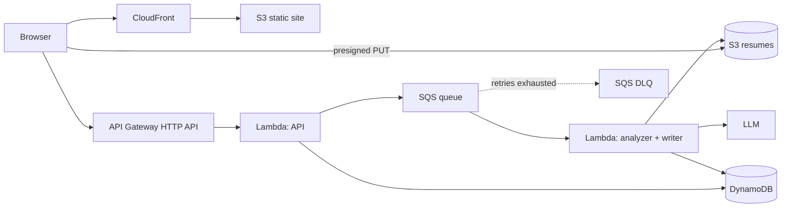

# Jobscope

**[Live app](https://d1kvuqf3mt7qda.cloudfront.net)** · Job application tracker with AI-powered skill-gap analytics, built entirely on AWS serverless.

Paste the link of a job posting. An async pipeline reads the page, fills in company and role, and extracts the required skills. Upload your resume and the dashboard shows exactly which of those skills you are missing, ranked by how often the market asks for them. Then it writes a resume and a cover letter aimed at one specific posting.

## What it does

| | |
|---|---|
| **URL-only intake** | You paste a link. The model fetches the posting itself, so there is no scraper to maintain and no form to fill in. |
| **Resume understanding** | Your resume is read by the same pipeline and turned into a structured profile: name, title, location, skills. |
| **Skill gap** | Requested skills are matched against your profile: what you have, what you are missing, a match score per application, and skills you have that nobody asks for. |
| **CV maker** | A resume and a cover letter written for one posting, selected from a master profile so nothing is invented, checked against ATS rules and a one-page limit. |
| **Everything async** | Postings, resumes and document generation all run off the request path through SQS, so the UI answers immediately and fills in as results land. |

### How the CV maker keeps itself honest

Generation is a loop, not a single call, and two of its rules are gates rather than suggestions:

- **A master profile is the only source of content.** Every claim traces back to it. If the posting asks for something that is not there, the requirement stays out and the gap is reported, named in the letter instead of hidden.
- **No em dash in prose.** It is the most recognizable fingerprint of generated text, so it blocks publication outright and the model is asked to rewrite.
- **One page each, measured rather than estimated.** The Lambda estimates fill and hands the model a percentage to cut when content overflows. The browser then measures the real height by rendering the document off-screen at exact print width, and prints to PDF through the frozen A4 stylesheet, which is why no headless Chromium is needed in Lambda.

## Architecture



| Concern | Service | Why |
|---|---|---|
| Frontend hosting | S3 + CloudFront (OAC) | Private bucket, HTTPS CDN, free tier |
| API | API Gateway HTTP API + Lambda (Node 22) | Pay-per-request, zero idle cost |
| Database | DynamoDB (on-demand, single-table) | Applications and profile share one table |
| Resume storage | Private S3 bucket, presigned PUT | The file never passes through API Gateway |
| Async work | SQS + Lambda + DLQ, partial batch failures | Retries without blocking the request path |
| Document rendering | Frozen A4 stylesheet, printed by the viewer's browser | Real PDF output with no headless browser in Lambda |
| Extraction | Gemini (`url_context` for pages, native PDF input for resumes) | Provider-agnostic module, swappable for Amazon Bedrock |
| Infrastructure | AWS CDK (TypeScript) | The entire stack is versioned code, one command to deploy |
| CI/CD | GitHub Actions + OIDC | Deploys assume an IAM role, no access keys stored |

## Pages

- **`#/home`** — profile, most requested skills, and the skill gap dashboard
- **`#/applications`** — add a posting by URL, track status (wishlist, applied, interview, offer, rejected)
- **`#/cv-maker`** — master profile upload, then a resume and cover letter per posting, with an A4 preview, measured page fill, and a coverage report

## Project layout

```
infra/   AWS CDK app (the whole infrastructure as TypeScript)
api/     Lambda handlers: CRUD, analytics, async analyzer
web/     React SPA (Vite), hash-routed, no router dependency
docs/    AWS account setup guide
```

## Running it yourself

Prerequisites: Node 20+, an AWS account ([setup guide](docs/SETUP-AWS.md)), and a free Gemini API key ([aistudio.google.com](https://aistudio.google.com/apikey)).

```bash
npm install

export GEMINI_API_KEY=your-key
cd infra && npx cdk bootstrap   # first time only
cd .. && npm run deploy
```

The deploy outputs `ApiUrl` and `WebUrl`. Put the API URL in `web/.env.production`, then deploy again so the frontend points at it.

## Cost

Everything runs inside the AWS Free Plan and the always-free tier: Lambda (1M requests/month), DynamoDB (25GB), SQS (1M messages/month), CloudFront (1TB/month), S3. The model runs on Gemini's free tier. Total: **$0/month**.

## Notes

Two problems worth writing down, since both are the kind that only show up in production:

- **GitHub's OIDC subject claim embeds numeric IDs.** A trust policy scoped to `repo:owner/name:*` never matches; CloudTrail showed the real claim as `repo:owner@54084311/name@1340924790:ref:...`. Scoping to the ID form fixed it.
- **DynamoDB `UpdateItem` creates the item when the key is absent.** An SQS retry landing after a delete resurrected a row with no `createdAt`, which broke the frontend sort. Every update is now guarded with `attribute_exists(pk)`.

## Roadmap

- [x] CDK stack, CRUD API, async pipeline, React SPA
- [x] CI/CD with GitHub Actions and OIDC
- [x] URL-only intake
- [x] Resume upload and skill-gap dashboard
- [x] CV maker: resume and cover letter per posting
- [ ] Cognito auth and multi-user support
