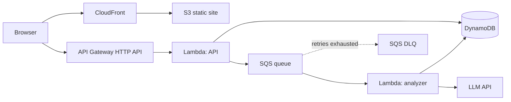

# Jobscope

Job application tracker with AI-powered skill-gap analytics, built entirely on AWS serverless — designed to stay within the AWS Free Plan (zero cost).

Track your job applications, paste each job description, and an async AI pipeline extracts the required skills. The dashboard then shows which skills appear most across the roles you're targeting — so you know exactly what to learn next.

## Architecture



| Concern | Service | Why |
|---|---|---|
| Frontend hosting | S3 + CloudFront (OAC) | Private bucket, HTTPS CDN, free tier |
| API | API Gateway HTTP API + Lambda (Node 22) | Pay-per-request, zero idle cost |
| Database | DynamoDB (on-demand, single-table) | Free tier 25GB, no servers |
| AI pipeline | SQS + Lambda + DLQ | Async, retryable, decoupled from the request path |
| Skill extraction | Gemini API (free tier) | Provider-agnostic module — swappable for Amazon Bedrock |
| Infrastructure | AWS CDK (TypeScript) | Entire stack versioned as code, one-command deploy |

## Project layout

```
infra/   AWS CDK app (the whole infrastructure as TypeScript)
api/     Lambda handlers (CRUD + async analyzer)
web/     React SPA (Vite)
docs/    Setup guides
```

## Getting started

Prerequisites: Node 20+, an AWS account (see [docs/SETUP-AWS.md](docs/SETUP-AWS.md)) and a free Gemini API key ([aistudio.google.com](https://aistudio.google.com/apikey)).

```bash
npm install

# local frontend dev (point VITE_API_URL at a deployed API)
npm run dev:web

# deploy everything (builds web, then cdk deploy)
export GEMINI_API_KEY=your-key
npm run build -w web
npx cdk bootstrap        # first time only, inside infra/
npm run deploy
```

The deploy outputs `ApiUrl` and `WebUrl`. Rebuild the frontend with `VITE_API_URL=<ApiUrl>` and redeploy to wire them together.

## Cost

Everything runs inside the AWS Free Plan / always-free tier: Lambda (1M req/month), DynamoDB (25GB), SQS (1M msg/month), CloudFront (1TB/month). The LLM runs on Gemini's free tier. Total: **$0/month**.

## Roadmap

- [x] Phase 1 — Scaffold: CDK stack, CRUD API, async AI pipeline, React SPA
- [ ] Phase 2 — First deploy + wire frontend to API
- [ ] Phase 3 — CI/CD with GitHub Actions (OIDC, no stored keys)
- [ ] Phase 4 — Analytics dashboard v2 (skill gap vs. my profile, trends)
- [ ] Phase 5 — Auth with Cognito, multi-user
- [ ] Phase 6 — Optional: swap Gemini for Amazon Bedrock
